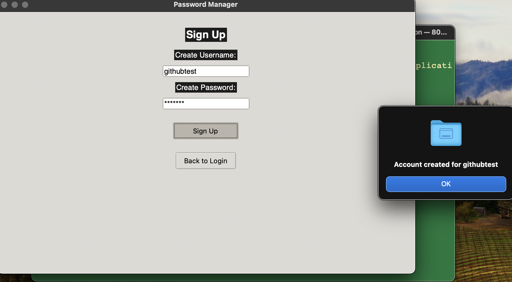

# Password Manager (Tkinter GUI - SQLite Database)

## Overview

This Password Manager is a desktop application built with Python, using Tkinter for the graphical user interface (GUI). It allows users to securely store and manage their passwords, generate new strong passwords, and retrieve stored passwords when needed. The application utilizes SQLite for local data storage and supports macOS Touch ID for enhanced security. The application is designed to run on macOS and is packaged using py2app.

## Features

- **User Authentication:**
  - **Master Password:** Secure login with a master password.
  - **Touch ID Support:** Optionally use Touch ID for quick and secure authentication on supported macOS devices.
- **Password Storage:** Store and manage passwords for multiple accounts securely using an SQLite database.
- **Password Generator:** Generate strong, random passwords.
- **Encryption:** All passwords are encrypted before storage to ensure security.
- **Cross-Platform:** Designed to run on macOS.

Adding password not shown but very simple, just input fields for website name - username - password. Everytime you want to view password you use fingerprint id or mac password

### Prerequisites

- Python 3.12 or later
- Homebrew (for macOS)
- Tkinter (installed by default with Python on macOS)
- SQLite3 (installed by default on macOS)

### SQLite
The application uses an SQLite database (passwords.db) to store all user data. 
The database is created automatically in the application's directory. 
To back up your data, simply copy the passwords.db file to a secure location.
